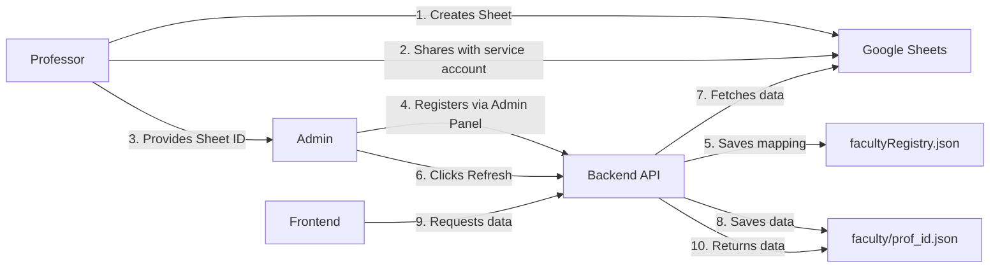

# ✅ Backend Implementation Complete

## 🎉 Summary

The backend has been successfully updated to support a **multi-faculty Google Sheets system** where each professor has their own individual Google Sheet.

---

## 📂 What Was Implemented

### 1. ✅ Updated Backend Server ([backend/server.js](backend/server.js))

**New API Endpoints:**
- `GET /api/faculty` - Get list of all registered faculty
- `GET /api/faculty/:facultyId` - Get complete data for a specific faculty
- `POST /api/faculty/register/:secretKey` - Register a new faculty with their Sheet ID
- `GET /api/faculty/:facultyId/refresh/:secretKey` - Refresh data from a specific faculty's sheet
- `GET /api/faculty/refreshAll/:secretKey` - Refresh all faculty data
- `DELETE /api/faculty/:facultyId/:secretKey` - Delete a faculty
- `GET /health` - Health check endpoint

**Key Features:**
- Faculty ID validation
- Duplicate sheet ID prevention
- Individual JSON file storage per faculty
- Comprehensive error handling
- Detailed logging

### 2. ✅ Updated Google Sheets Integration ([backend/googleSheets.js](backend/googleSheets.js))

**New Function:**
- `generateFacultyJSONFromSheet(sheetID)` - Fetches data from a specific faculty's Google Sheet

**Features:**
- Graceful handling of missing sheets
- Supports same structure as old system
- Error handling for each sheet tab
- Automatic data normalization

### 3. ✅ New Data Structure

```
backend/data/
├── facultyRegistry.json          # Central registry (maps faculty ID → Sheet ID)
└── faculty/                      # Individual faculty data files
    ├── prof_john_doe.json
    ├── prof_jane_smith.json
    └── ...
```

**Faculty Registry Format:**
```json
[
  {
    "facultyID": "prof_john_doe",
    "sheetID": "1ABC123...",
    "name": "Dr. John Doe",
    "email": "john@iitdh.ac.in",
    "department": "Computer Science",
    "jsonFile": "prof_john_doe.json",
    "registeredAt": "2026-02-13T10:00:00.000Z",
    "lastUpdated": "2026-02-13T10:30:00.000Z"
  }
]
```

### 4. ✅ New Admin Panel ([test-admin.html](test-admin.html))

**Features:**
- Registration form for new faculty
- Refresh single faculty data
- Refresh all faculty data
- View registered faculty list
- Delete faculty

**Beautifully designed with:**
- Clean modern UI
- Real-time validation
- Detailed response messages
- Auto-refresh faculty list

### 5. ✅ Documentation

Created comprehensive documentation:
- [backend/README.md](backend/README.md) - Complete API documentation
- [QUICKSTART.md](QUICKSTART.md) - 5-minute setup guide
- Flow diagrams (Mermaid) showing system architecture

### 6. ✅ Removed Obsolete Code

Deleted:
- `backend/refresh-data.js` - No longer needed (replaced by API endpoints)

Updated:
- `backend/.gitignore` - Configured for new data structure

---

## 🔄 How It Works Now

### Workflow Diagram



### Key Improvements

**Before:**
- ❌ Single Google Sheet for all faculty
- ❌ All data in one `facultyData.json` file
- ❌ No way to manage individual faculty
- ❌ Manual refresh script

**After:**
- ✅ Each professor has their own Google Sheet
- ✅ Individual JSON files per faculty
- ✅ Full CRUD operations via API
- ✅ Web-based admin panel
- ✅ Independent updates per faculty
- ✅ Scalable architecture

---

## 🚀 Next Steps

### 1. Test the Backend

```bash
# Start the server
cd backend
npm start
```

Visit: `http://localhost:5000/health`

### 2. Open Admin Panel

Open `test-admin.html` in your browser

### 3. Register First Faculty

Use the admin panel to:
1. Register a faculty with their Sheet ID
2. Refresh data from their sheet
3. View the faculty list

### 4. Test API Endpoints

```bash
# Get all faculty
curl http://localhost:5000/api/faculty

# Get specific faculty
curl http://localhost:5000/api/faculty/prof_john_doe

# Register faculty
curl -X POST http://localhost:5000/api/faculty/register/YOUR_SECRET_KEY \
  -H "Content-Type: application/json" \
  -d '{"facultyID":"test_prof","sheetID":"1ABC..."}'
```

---

## 📊 File Changes

### Modified Files:
1. ✏️  `backend/server.js` - Complete rewrite with new endpoints
2. ✏️  `backend/googleSheets.js` - Added `generateFacultyJSONFromSheet()`
3. ✏️  `test-admin.html` - New comprehensive admin interface
4. ✏️  `backend/.gitignore` - Updated for new structure

### New Files:
1. ✨ `backend/data/facultyRegistry.json` - Faculty registry
2. ✨ `backend/data/faculty/` - Directory for faculty data files
3. ✨ `backend/README.md` - Complete API documentation
4. ✨ `QUICKSTART.md` - Setup guide

### Deleted Files:
1. 🗑️  `backend/refresh-data.js` - Obsolete script

---

## 🔐 Security Notes

1. **Secret Key**: Set `REFRESH_SECRET_KEY` in `.env`
2. **Google Credentials**: Use environment variable or file
3. **Git Ignore**: Faculty data files are automatically ignored
4. **Registry**: Only metadata is stored, not sensitive data

---

## 📖 Documentation

All documentation is available:
- **Quick Start**: See [QUICKSTART.md](QUICKSTART.md)
- **API Docs**: See [backend/README.md](backend/README.md)
- **Flow Diagrams**: See Mermaid diagrams above

---

## ✨ Features

### For Administrators:
- ✅ Web-based admin panel
- ✅ Register/delete faculty members
- ✅ Refresh data individually or in bulk
- ✅ View all registered faculty
- ✅ Real-time validation

### For Faculty:
- ✅ Each professor manages their own Google Sheet
- ✅ Independent updates (doesn't affect others)
- ✅ Same familiar sheet structure
- ✅ Privacy (separate data files)

### For Developers:
- ✅ RESTful API endpoints
- ✅ Comprehensive error handling
- ✅ Detailed logs
- ✅ Type-safe structure
- ✅ Scalable architecture

---

## 🎯 Testing Checklist

Before deployment:

- [ ] Test server starts without errors
- [ ] Health endpoint responds
- [ ] Register a test faculty
- [ ] Refresh faculty data from sheet
- [ ] View faculty list
- [ ] Get specific faculty data
- [ ] Delete test faculty
- [ ] Check error handling (invalid secret key, missing faculty, etc.)

---

## 📞 Support

If you encounter issues:
1. Check server logs for error messages
2. Review [backend/README.md](backend/README.md) for API details
3. See [QUICKSTART.md](QUICKSTART.md) for setup help
4. Verify Google Sheet is shared with service account
5. Ensure `.env` file has correct secret key

---

## 🎉 Ready to Go!

Your backend is now fully implemented with:
- ✅ Multi-faculty support
- ✅ Individual Google Sheets
- ✅ Web admin panel
- ✅ Complete API
- ✅ Documentation

**Next**: Start the server and test with the admin panel!

```bash
cd backend
npm start
```

Then open `test-admin.html` in your browser and register your first faculty!
